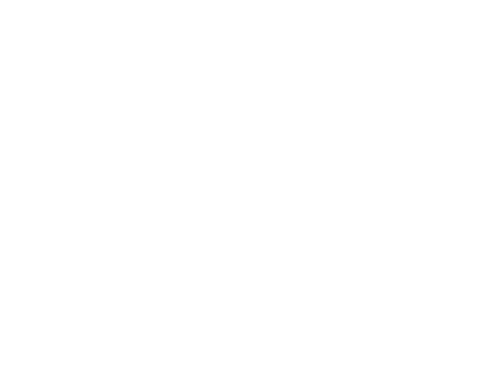

# Spam Classifier Notes
## Introduction
In this document, we will discuss the implementation of a spam classifier using machine learning techniques. The goal of the spam classifier is to identify and filter out unwanted emails (spam) from legitimate emails (ham).
## Data Collection
To build a spam classifier, we need a dataset that contains labeled examples of both spam and ham emails. One commonly used dataset for this purpose is the SMS Spam Collection, which contains a collection of SMS messages labeled as spam or ham.
## Data Preprocessing
Before training the model, we need to preprocess the data. This includes:
1. **Adding a new column**: We can add a new column to the dataset to indicate whether an email is spam or ham. For example, we can create a binary column where 1 represents spam and 0 represents ham.
2. **Adding a Count Vectorizer**: We can use a Count Vectorizer to convert the text data into a numerical format that can be used by machine learning algorithms. The Count Vectorizer will create a matrix of token counts for each email.
## Model Training
Once the data is preprocessed, we can train a machine learning model to classify emails as spam or ham. Common algorithms for this task include:
- Naive Bayes
- Support Vector Machines (SVM)
- Random Forest
- Logistic Regression
We used a multinomial Naive Bayes classifier for this task, which is effective for text classification problems.
## Model Evaluation
After training the model, we need to evaluate its performance using metrics such as:
- Accuracy
- Precision
- Recall
- F1 Score

We can use a confusion matrix to visualize the performance of the model and identify any misclassifications.
## Plot of Spam vs Ham
To visualize the distribution of spam and ham emails in the dataset, we can create a bar plot showing the count of each class. This can help us understand the balance of the dataset and identify any potential issues with class imbalance, which can affect the performance of the model. We can use libraries such as Matplotlib or Seaborn to create this plot.  We used Matplotlib to create a bar plot that shows the count of spam and ham emails in the dataset, which helps us understand the distribution of the classes and identify any potential issues with class imbalance. The plot is shown below:

## Conclusion
In conclusion, building a spam classifier involves collecting and preprocessing data, training a machine learning model,and evaluating its performance. By following these steps, we can create an effective spam classifier that helps filter out unwanted emails and improve the user experience.  The code for this is in the `datasets/spam_classifier.py` file.